# \color{NavyBlue}{MÒDUL: Aplicacions Ofimàtiques (AOF)}

`Código` :0223

`Equivalència en crèdits ECTS` :9

`Hores setmanals` :7

`Hores totals` :224

Aquest mòdul professional proporciona la formació necessària per a la utilització, gestió i aplicació de les eines ofimàtiques en l'àmbit empresarial, amb un enfocament a la seva aplicació pràctica per a l'optimització dels processos administratius i de gestió de la informació. Les activitats professionals associades a aquest mòdul s'apliquen a l'àrea de gestió empresarial mitjançant l'ús de software ofimàtic.
Funcions a desenvolupar:

Les activitats formatives del mòdul d'Aplicacions Ofimàtiques inclouen els següents aspectes:

- Ús de processadors de text per a la creació i edició de documents corporatius, cartes, informes, i altres textos relacionats amb la gestió empresarial.
- Gestió de fulls de càlcul per a la creació d'informes, anàlisi de dades, gestió de comptes, càlculs d'estadístiques i elaboració de pressupostos.
- Ús de bases de dades per a la creació i gestió d'arxius de dades, amb l'objectiu de portar un control de clients, proveïdors, inventaris o qualsevol altra informació necessària per a l'activitat empresarial.
- Creació de presentacions per a exposicions corporatives, reunions o formacions internes.
- Gestió de correu electrònic i calendari per a la comunicació empresarial, organització de reunions i seguiment de tasques.

# \color{NavyBlue}{Objectius específics del mòdul}

La formació del mòdul contribueix a assolir els objectius generals a), c), g), h), i), k), l), m), n) i o) del cicle formatiu.

a) Organitzar els components físics i lògics que formen un sistema microinformàtic, interpretant la seua documentació tècnica, per a aplicar els mitjans i mètodes adequats a la seua instal·lació, muntatge i manteniment.

c) Reconéixer i executar els procediments d'instal·lació de sistemes operatius i programes d'aplicació, aplicant protocols de qualitat, per a instal·lar i configurar sistemes microinformàtics.

g) Localitzar i reparar avaries i disfuncions en els components físics i lògics per a mantindre sistemes microinformàtics i xarxes locals.

h) Substituir i ajustar components físics i lògics per a mantindre sistemes microinformàtics i xarxes locals.

i) Interpretar i seleccionar informació per a elaborar documentació tècnica i administrativa.

k) Reconéixer característiques i possibilitats dels components físics i lògics, per a assessorar i assistir a clients.

l) Detectar i analitzar canvis tecnològics per a triar noves alternatives i mantindre's actualitzat dins del sector.

m) Reconéixer i valorar incidències, determinant les seues causes i descrivint les accions correctores per a resoldre-les.

n) Analitzar i descriure procediments de qualitat, prevenció de riscos laborals i mediambientals, assenyalant les accions a realitzar en els casos definits per a actuar d'acord amb les normes estandarditzades.

o) Identificar i valorar les oportunitats d'aprenentatge i ocupació, analitzant les ofertes i demandes del mercat laboral per a gestionar la seua carrera professional.

# \color{NavyBlue}{Competències}

La formació del mòdul contribueix a assolir les competències professionals, personals i socials a), c), f), g), h), j), k), l), m), n), ñ), p) i r) del títol.

a) Determinar la logística associada a les operacions d'instal·lació, configuració i manteniment de sistemes microinformàtics, interpretant la documentació tècnica associada i organitzant els recursos necessaris.

c) Instal·lar i configurar programari bàsic i d'aplicació, assegurant el seu funcionament en condicions de qualitat i seguretat.

f) Instal·lar, configurar i mantenir serveis multiusuari, aplicacions i dispositius compartits en un entorn de xarxa local, atenent a les necessitats i requisits especificats.

g) Realitzar les proves funcionals en sistemes microinformàtics i xarxes locals, localitzant i diagnosticant disfuncions, per comprovar i ajustar el seu funcionament.

h) Mantenir sistemes microinformàtics i xarxes locals, substituint, actualitzant i ajustant els seus components, per assegurar el rendiment del sistema en condicions de qualitat i seguretat.

j) Elaborar documentació tècnica i administrativa del sistema, complint les normes i regulació del sector, per al seu manteniment i l'assistència al client.

k) Elaborar pressupostos de sistemes a mida complint els requisits del client.

l) Assessora i assistix al client, canalitzant a un nivell superior els supòsits que així ho requereixen, per trobar solucions adequades a les necessitats d'aquest.

m) Organitzar i desenvolupar la tasca assignada mantenint unes relacions professionals adequades en l'entorn de treball.

n) Mantenir un esperit constant d'innovació i actualització en l'àmbit del sector informàtic.

ñ) Utilitzar els mitjans de consulta disponibles, seleccionant el més adequat en cada cas, per resoldre en temps raonable supòsits no coneguts i dubtes professionals.

p) Complir amb els objectius de la producció, col·laborant amb l'equip de treball i actuant conforme als principis de responsabilitat i tolerància.

r) Resoldre problemes i prendre decisions individuals seguint les normes i procediments establerts dins de l'àmbit de la seua competència.

# \color{NavyBlue}{Resultats d'aprenentatge}

## Els resultats d’aprenentatge del mòdul
 
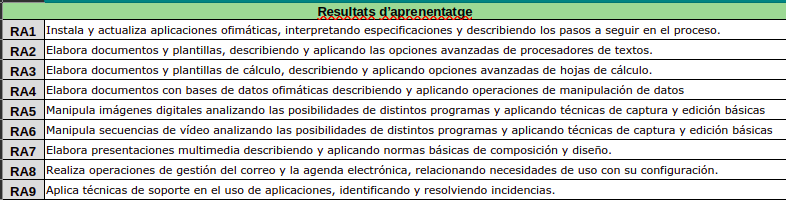
   
## Relació entre els resultats d’aprenentatge i els criteris d'avaluació

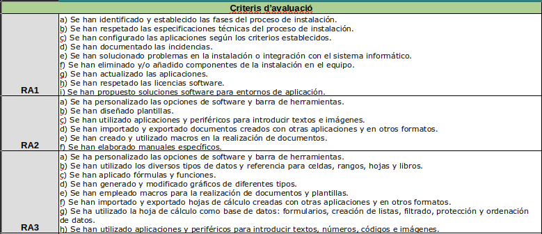
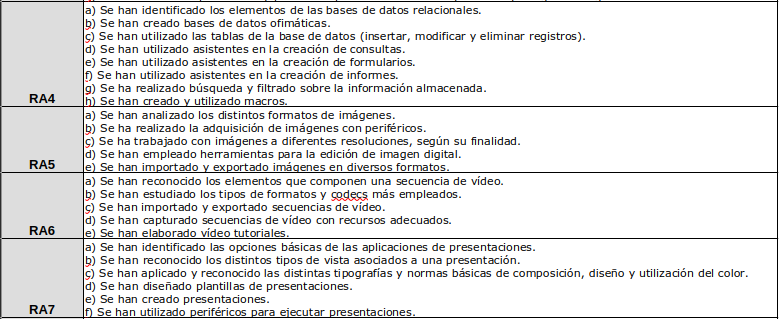
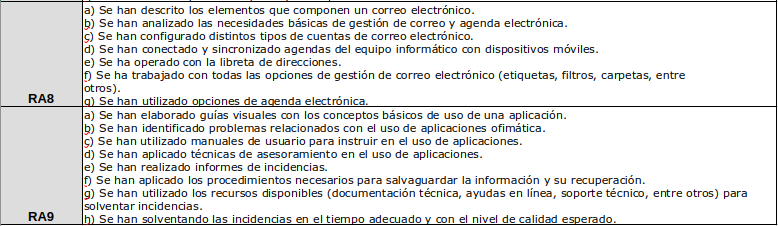

# \color{NavyBlue}{Contingut. Unitats didàctiques}

## Contingut de les unitats didàctiques 

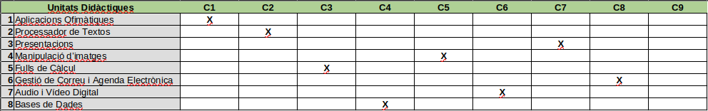
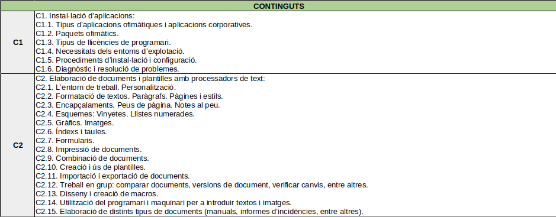
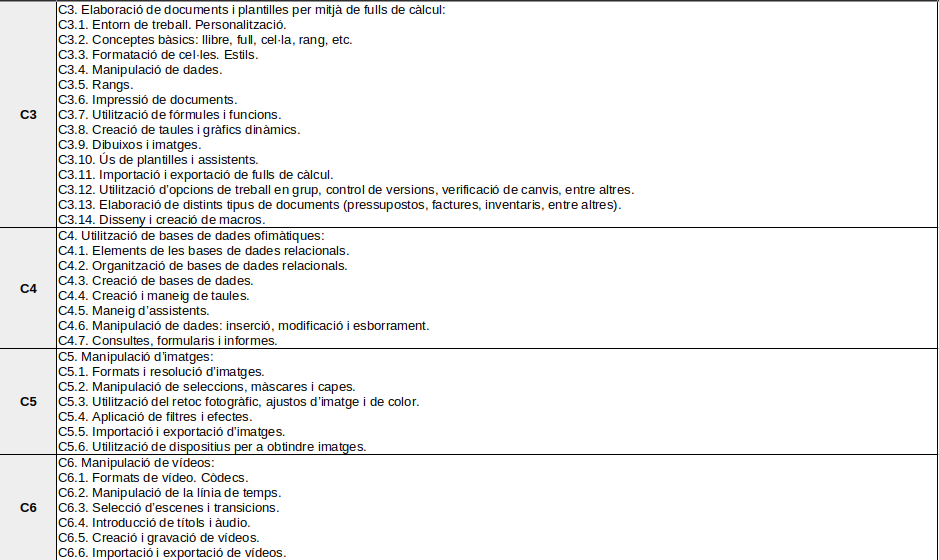
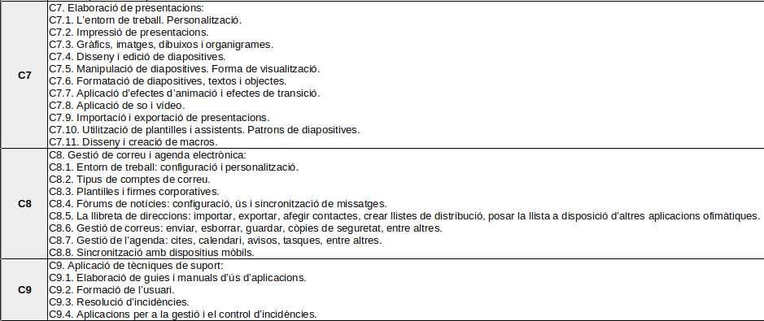

## Distribució temporal de les unitats didàctiques       

_Hores per trimestre,  total de trimestres i  h anuals establertes._

| 1r Trimestre                              | 2n Trimestre                        | 3r Trimestre                      |
| :---------------------------------------: | :---------------------------------: | :-------------------------------: |
| `95 hores`                                | `75 hores`                          | `54 hores`                        |
| Unitats Didàctiques: UD1, UD2, UD3, UD4   | Unitats Didàctiques : UD4, UD5, UD6 | Unitats Didàctiques : UD7, UD8    |
| _Avaluació: 3 - 5 h._                     | _Avaluació: 3 - 5 h._               | _Avaluació: 3 - 5 h._             |

## Metodologia. Orientacions Didàctiques. Activitats i  Estratègies d'ensenyament i aprenentatge. 

La metodologia utilitzada serà principalment procedimental: pràctica. 

Les **línies d'actuació** en el procés d'ensenyament-aprenentatge que permeten assolir els objectius del mòdul estan relacionades amb:

- La identificació del maquinari necessari.
- L'anàlisi dels canvis i les novetats que es produeixen en les diferents suites ofimàtiques i programes relacionats.
- La interpretació de documentació tècnica.
- La instal·lació i actualització de paquets ofimàtics.
- L'utilització de diferents eines ofimàtiques en funció de les necesitats puntuals.
- L'elaboració de documentació tècnica.
- La col·laboració amb altres usuaris en l'elaboració de documentació i gestió de la mateixa.
- Soft skills rel·laciones amb l'ús d'eines ofimàtiques, com ara les rel·lacionades amb les presentacions en públic.

# \color{NavyBlue}{AVALUACIÓ}

## Criteris d'avaluació  

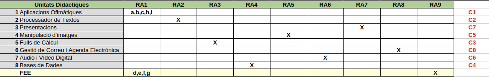
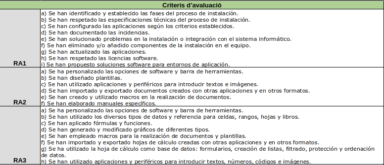
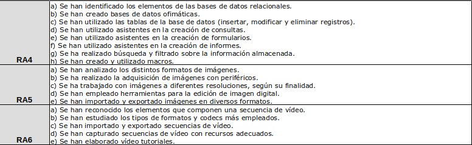
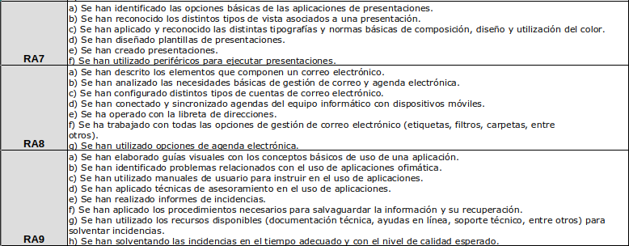

## Instruments d'avaluació 

# TODO FALTA COMPLETAR

<!--

-->

## Tipus d'avaluació. 

`L'avaluació serà continua i tindrà en compte el progrés de l'alumne.`

No obstant, encara que la avaluació es faça continua, hi ha tres moments en els que es materialitza durant el curs. Estos moments són:

- Avaluació inicial.
- Avaluació processal.
- Avaluació final.

> En el cicle presencial se requereix l’assistència, almenys, al 85% de classes i activitats programadas en el mòdul. Per tant, l’alumnat que supere el 15% de faltes d’assistència perdrà el dret a l’avaluació continua.

## Criteris de qualificació. 

<!--

-->

El mòdul estarà superat si s'han superat tots els Resultats d'Aprenentatge.

La nota final del mòdul s'obtindrà aplicant el pes corresponent a cadascun dels Resultats d'Aprenentage.

::: important
Qm = (Qra1 + Qra2 + Qra3 + Qra4 + Qra5 + Qra6 + Qra7 + Qra8 + Qra9) / 9

Qm = Qualificació del mòdul
QraN = Qualificació del Resultat d'Aprenentage N
Totes les QRA han de ser >=5 per obtindre Qm.
:::

::: warning
Si s'utilitzen hores del mòdul en DUAL per a la formació en l'empresa, s'ajustarien els pesos dels RA's implicats i se sumaria la qualificació obtinguda en l'empresa segons el seu pes
:::

# \color{NavyBlue}{Recursos necessaris}

## Adreces WEB interessants 

- https://es.libreoffice.org/
- https://www.office.com/
- https://www.canva.com/es_es/
- https://www.openshot.org/es/
- https://abeneto.com/aof/index.html

## Llibres 

Aplicaciones ofimáticas. Libro digital interactivo. Editorial: McGraw Hill

## Recursos materials 

### Hardware

Aula d’informàtica normalment equipada i amb TCP/IP, servidor local i sistema de còpies de seguretat.

### Software 

Suite Libre Office

Office 365 (Compte proporcionat per GVA)

Canva

Navegador Web (Chrome, Firefox...)

OpenShot

Eixida a internet per localitzar informació puntual

